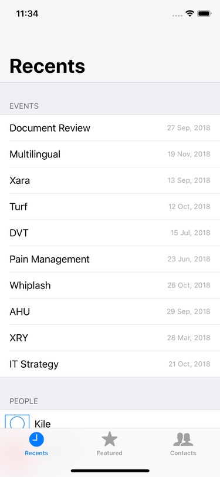
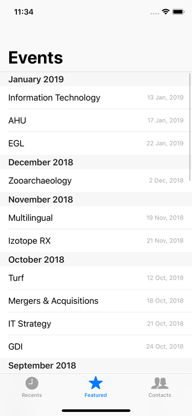
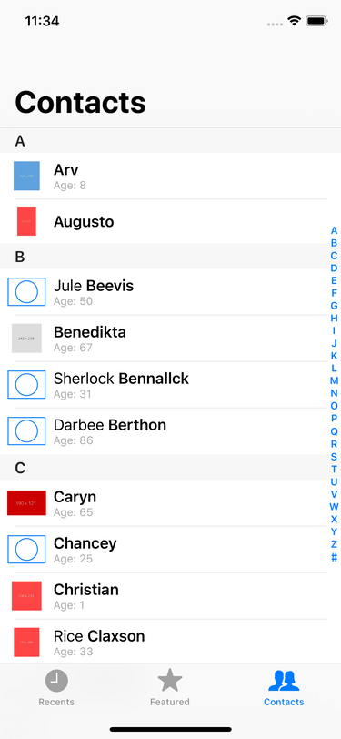

# GoTest

## About

This is designed to exercise a broad range of skills, and to resemble work done in a regular iOS project. None of the exercises are meant to be trick questions, if anything in this document is confusing or unclear, please contact us and we’ll get back to you with a clarification as soon as possible. The estimated completion time is less than 4 hours.

When possible, try to match the existing code style. The project currently has no warnings or errors in Swiftlint 0.30.1 with the default rule set, and having no linter errors in project that you return.

## Getting Started

This project uses [CocoaPods](https://cocoapods.org). To be able to build and run, you’ll need to install the pods before you open anything.

Once you have the project open, there are some improvements to be made to the app.

There are `EventCell` and `PersonCell` classes provided for displaying events and people. They offer a `func configure(with event: Event)` and `configure(with person: Person, isSorted: Bool)` as the preferred method for preparing the content in the cell.

## Data sources

### RecentViewController

This view controller should show up to 2 sections. The first section should be titled “Events” and contain the first 10 events from the array of `event` objects passed into the view controller at launch.

The second section should  be titled “People” and contain the first 10 people from the array of `person` objects passed into the view controller at launch. If either of these arrays are empty, the corresponding section should be hidden.

### EventsViewController

This view controller currently displays all of the events in 1 section. The view controller should be updated so that:

- The data is sectioned by month, sorted reverse chronologically (newest first).
- Each section uses the `"MMMM yyyy"` date format to format the title.
- The rows in each section should be sorted chronologically (oldest first).

### PeopleViewController

This view controller currently displays all of the people in 1 section. The view controller should be updated so that:

- The data is sorted by either the last name if one is present, the first name if the last name is not present.
- The data is sectioned by the first letter of the value that was used for the sort index.
- The section title should be the first letter of the value that was used for the sort index.
- When the user taps on the section title on the right hand side of the view, the table view should scroll to the appropriate section. If there are no entries in a particular section, the table view should scroll to the next section that contains entries.

## Cells

### EventCell
- There’s a constraint error in the event cell, fix the constraint error so that the content stack lays out properly within the layout margins of the content view.

### PersonCell

- Add the profile image view to the left hand side of the view.
    - The profile image view should always have a 4:3 aspect ratio.
    - The profile image view should be 32pt tall.
    - It should be inset by the system spacing horizontally within the content view.
    - It should be centered vertically within the content view.
    - It should be inset by at least the system spacing vertically within the content view.
- The `configure(with person: Person, isSorted: Bool)` should be updated to used [`SDWebImage`](https://github.com/SDWebImage/SDWebImage) to load the profile picture of the `person` value, and to use `UIImage.placeholder` when loading, and if no image exists.
- Update the extension on `Person` so that `fullName(highlightSortValue: Bool, baseFont: UIFont)` bolds the value that is used for searching and sorting.

## Screenshots

### Recents

### Events

### Contacts

